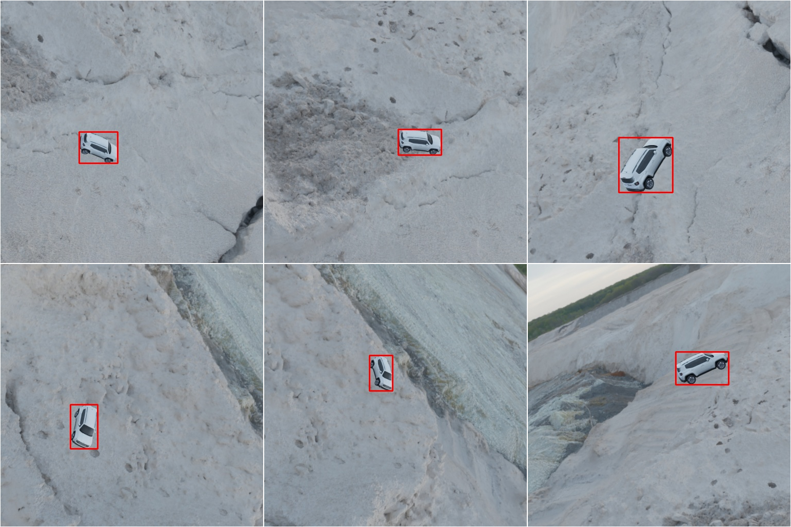

# A simple dockerised service for Bounding Box and Segementation data generation using Blenderproc

[](https://www.gnu.org/licenses/gpl-3.0)



## Requirements:
- Linux 20.04
- Python 3.5.2+
- Docker

# Setup
## Prepare objects/scenes
Objects/scenes are available across the web. A couple of good free sites:
- Objects: [Free3d](https://free3d.com/)
- Scenes: [PolyHaven](https://polyhaven.com/)

## Prepare output folder structure
The microservice by default outputs data to /data/nfs1/synth, using /data/nfs1/synth/temp during creation. 
Before commencing, create this directory structure and set permissions to -rwxrwsrwx using:
````bash
chmod -R 2777 /data/nfs1
````

## The Data Generation process
This microservice creates a kubernetes pod/docker container which fulfils requests. The process:
 - Uses [Swagger CodeGen](https://swagger.io/tools/swagger-codegen/) to generate server code
 - Builds the [BlenderProc](https://hub.docker.com/r/blenderproc/blenderproc) docker
 - Builds and deploys the data generation microservice
 - Sends a data generation request after a small wait to test the service end to end
 - Further requests can be sent by modifying the request.json and running:
````bash
make curl_docker
````
Annotations are produced in the standard COCO json format.

## Run the Data Generation microservice in docker
````bash
make all_docker
````
## Run the Data Generation microservice in kubernetes
````bash
make all_kube # if sudo is required
make all_nosudo # if not
````

# Modifying the scene
The request.json specifies details of how the scene is produced. The flow of the program is as follows:
 - A point of interest is specified in the scene where the model is placed
 - The program stochasticly shifts the point of interest (within a range) so the object isn't in the direct centre of the screen (camera_shift_range_xyz)
 - The program specifies a random camera location within a range (camera_location_range_xyz)
 - The rotation matrix calculates the camera angle change required to point the camera towards the point of interest
